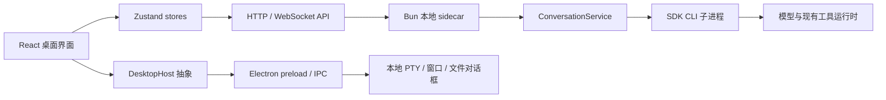
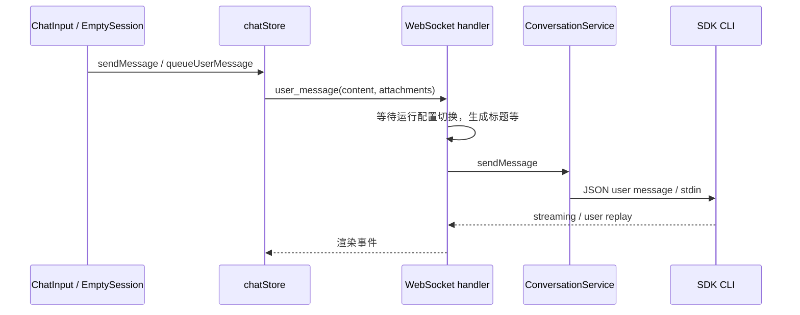

# 当前项目分析说明

## 1. 分析结论

当前项目已有适合承载本功能的桌面工作台、页签管理、终端显示和 Agent 会话链路，但没有完整的远程主机领域模型，也没有可直接复用的 SSH/SFTP 服务。本次功能应作为一个独立桌面模块接入，并对聊天发送协议做小范围扩展。

最需要避免的实现偏差是：把本地终端里执行 `ssh` 当成完整主机管理；只改已有会话而遗漏首页首轮；把所有资料直接拼进输入框；把“记忆”文件当成有依赖关系的概念库；只隐藏聊天气泡中的密码，却让标题、索引和 Trace 继续收集密码。

## 2. 调查依据与限制

| 项目 | 实际证据 |
|---|---|
| 仓库 | `D:\srcs\cchaha\cc-haha`，HEAD `5e1b9e0193dc6c6e17efdf2fbf2023a0db4afe4f` |
| 根包 | Bun 项目，TypeScript ESM，`packageManager: bun@1.3.14` |
| 桌面包 | React 18、Zustand 5、Electron 42 声明、Vite、TypeScript；应用版本 0.5.5 |
| 终端依赖 | `@xterm/xterm ^6.0.0`、`@xterm/addon-fit ^0.11.0`、`node-pty ^1.1.0` |
| 现有 SSH | 调查的生产代码和依赖清单中未找到 SSH/SFTP 服务或 `ssh2` 依赖 |
| 运行界面 | 用户提供的标题栏、聊天输入、设置页截图；不是本次工具完成的端到端测试 |
| Bundle | `D:\tools\cc-haha-desktop-2026-09-05`，包含 `cc-haha/`、依赖、启动脚本、运行目录；读取了 README 和包版本，未执行启停脚本 |
| 未进行 | 产品代码修改、真实 SSH/模型请求、实际密码读取、现有功能的全量测试 |

行号仅用于定位 2026-09-06 的工作树；接手时应搜索符号确认最新位置。下文“已有”描述源代码事实，“建议/新增”属于设计决定。

## 3. 整体架构与功能位置

`src/` 同时包含 CLI、工具运行时、服务和服务器；`desktop/` 包含 React 与 Electron；`adapters/` 通过 HTTP/WS 接入 IM；`site/` 用 `docs/` 内容构建网站。因此“给 Agent UI 加功能”并不意味着应把 SSH 网络能力塞进 React 或改写模型 Provider。

新增能力最自然的边界：React 负责主机工作台和上下文选择；Electron 负责 SSH、文件系统及本地凭据库；sidecar 只负责接收已准备好的上下文并接入既有发送链。

## 4. 真实源码接入图

### 4.1 标题栏与路由

| 源码 | 已有行为 | 新功能接入 |
|---|---|---|
| `desktop/src/components/layout/TabBar.tsx:615` | 右上工具区；623 左右本地终端，638 左右工作区目录 | 增加 `Server` 图标及 `openHostsTab()`，无活动会话也可打开 |
| `desktop/src/stores/tabStore.ts:21` | `TabType`，特殊页签、关闭、保存与恢复 | 增加 `hosts` 与固定 ID `__hosts__`，同时覆盖恢复规则 |
| `desktop/src/components/layout/ContentRouter.tsx:18` | 按 tab 类型分派页面，没有 React Router | 挂载独立 `HostsWorkspace` |
| `ContentRouter.tsx:90` | 本地终端切换页签仍挂载 | SSH 工作台也需保活；关闭时才处理连接和脏编辑 |
| `desktop/src/pages/Settings.tsx:62` | 设置导航及内容分支 | 增加概念知识导航和独立页面 |
| `desktop/src/stores/uiStore.ts:44` | `SETTINGS_TABS` 及 pending navigation | 增加 `concepts`，保持跳转消费逻辑 |

主机工作台不能写成只有聊天打开才可见的附属面板；用户需要从任何桌面页面管理主机。设置页截图已存在“记忆”，概念知识放在其后即可，无需新增另一个“系统管理”外壳。

### 4.2 两套输入组件

| 环节 | 已有会话 | 首页首轮 |
|---|---|---|
| 组件 | `components/chat/ChatInput.tsx` | `pages/EmptySession.tsx` |
| slash 检测/选择 | 566 / 627 附近 | 414 / 590 附近 |
| 发送动作 | `handleSubmit` 706 附近 | 创建会话 367，连接 384，发送 396 附近 |
| 按钮插入 | 1469 后，1470 `ModelSelector` 前 | 832 `ModelSelector` 前 |
| 特殊边界 | 792–825 首轮可能替换 sessionId | 选择上下文时还没有真实 sessionId |

必须共用选择器和引用控制器，同时支持 `draftId -> sessionId` 迁移。只改 `ChatInput` 会漏掉最常见的“新会话选服务器后直接提问”。

### 4.3 Slash 命令不是简单加两个选项

`desktop/src/components/chat/composerUtils.ts` 已包含命令描述、fallback、保留命令和本地 UI action。`findSlashTrigger:346` 在 token 中遇到空白即返回空；`resolveSlashUiAction:237` 只匹配完整命令。

因此新增 `/hh ` 后的标签过滤，必须有专用的上下文触发解析。`hh/ce` 应加入本地保留命令，避免同名工作流抢占。选择条目只创建上下文 chip，不能把 `/hh 标签名` 当成普通 prompt 发给模型。现有 `/goal` 参数、`/model`、代码块、路径输入与中文输入法组合事件都需要回归覆盖。

### 4.4 聊天发送与回放

需要同时阅读的接点：

- `desktop/src/stores/chatStore.ts:1919` 普通发送、2088 WS 发送；2607 入队、2656 出队、2693 另一发送点。
- `desktop/src/api/websocket.ts` 连接与 pending buffer；`desktop/src/types/chat.ts:11` 客户端协议。
- `src/server/ws/events.ts` 对应协议；`src/server/ws/handler.ts:792` 当前生成 user UUID，798/875 等待 runtime transition。
- `src/server/services/conversationService.ts` 的 `sendMessage`、`sendSdkMessage` 和 `pendingOutbound`。
- `handler.ts:3021` 当前 `user_message_replay` 主要携带 content；`chatStore.ts:5511` 附近存在按文本回放处理。
- 团队成员和子 Agent 走不同 REST 分支（`chatStore.ts:2027/2054`），不能假定扩展普通 WS 就自动支持所有入口。

新功能应携带稳定 UUID、引用 manifest 和票据，而不是让隐藏字段保存完整密码 prompt。请求 ID 必须贯穿即时发送、排队、恢复和回放，不靠文本判断“是不是重复发送”。

## 5. 终端、传输与编辑的复用范围

| 能力 | 可以复用 | 必须新增 |
|---|---|---|
| 终端显示 | xterm、FitAddon、主题、输入/resize/attach 生命周期 | SSH channel transport、连接状态、主机密钥验证、身份绑定 |
| 本地 PTY | `electron/services/terminal.ts` 的资源所有权/清理模式 | SSH 不走本地 PTY，不经 `sshpass` 或 shell 拼密码 |
| 文件树 | 工作区的布局/交互思路、图标和通用原语 | SFTP 目录读取、远程 POSIX 路径、上传/下载任务 |
| 在线编辑 | `MemorySettings` 的文本编辑/脏状态交互 | 远程读取、版本校验、冲突对比、可靠保存 |
| 凭据存储 | DesktopHost 和 Electron IPC 边界 | 受保护的独立 vault、记录级加密、解锁状态 |
| 标签与概念 | 表单、搜索、Badge、列表样式 | 标签关联、概念关系图、闭包解析及修订控制 |

`desktop/src/components/workspace/WorkspaceCodeSurface.tsx` 实际是 diff surface 的兼容导出，不是现成的可编辑 IDE。项目没有 Monaco/CodeMirror。第一版用现有 `TextArea` 做普通文本编辑，支持搜索、保存、换行格式和冲突对比即可；不得把新编辑器库当成必要前提。

`lib/terminalRuntime.ts` 保存本地 runtime；相关测试集中在 `pages/TerminalSettings.test.tsx`。可以提取小范围显示层生命周期，但不应借此全面重构本地终端。

## 6. 密码与跨进程边界的实际风险

### 6.1 现有 displayContent 不构成秘密隔离

`ChatInput` 已分别计算 model-facing 与 display 文本，但 `chatStore` 会保存 `modelContent`，队列也保留发送正文。直接拼接主机密码会进入前端状态，气泡不显示不能证明密码不存在于状态或历史。

标题生成不仅可能使用首轮 `message.content`（`handler.ts:830/843`、`titleService.ts:160`），也有绑定 assistant text 的路径（`handler.ts:2414`）。只处理第一次标题输入不够。包含密码的会话应禁用模型标题，使用用户可见正文生成本地标题。

### 6.2 SDK 本身会落盘

`src/utils/sessionStorage.ts:1100–1126` 持久化输入消息，1136 附近还缓存最后 prompt。密码被注入后可能进入 SDK JSONL、模型历史、后续压缩、委派、工具及切换后的 Provider。这不能由 Electron vault 加密或一次性票据消除。

设计必须明确：vault 保护管理库的静态存储；票据避免把展开正文交给 renderer；应用投影避免额外展示和索引；**它们都不等于已经向模型披露的密码可以撤回或永不落盘**。

`traceCapture.ts:1077` 附近的既有脱敏主要针对 token 形式，普通 Linux 密码不一定匹配。新设计应对敏感会话关闭完整 Trace 内容捕获和全文索引，并验证所有应用侧读取链路；不依赖通用正则“猜出所有密码”。

### 6.3 不能把 sidecar 当成天然仅本地

`desktop/electron/services/sidecarManager.ts:27` 的 `SERVER_BIND_HOST` 为 `0.0.0.0`；控制连接使用 `127.0.0.1`。服务器还承载 H5/pet 等访问策略。

新增上下文票据路由必须显式检查 `isLocalAccessAuthorized` 和真实 loopback 来源，不能只依赖通用认证或“没有 Origin”。现有 local token 能到达 renderer 和 adapter，不能把它描述成主进程独占的安全秘密。

### 6.4 客户端平台固定为 Windows 10/11

用户已把桌面客户端运行范围限定为 Windows 10 和 Windows 11。凭据库只需实现和验收 Electron `safeStorage` 在 Windows 上的受保护存储路径；加密不可用或加解密自检失败时，只允许会话内临时使用凭据，保存必须返回明确错误，不能降级为明文或 base64。

macOS 的 mock keychain、Swift sidecar、macOS 打包以及 Linux 桌面的 `basic_text` 后端均不在本功能范围内，不应为它们修改产品代码或让其平台专用测试阻塞 Windows 交付。远端受管目标仍是 Linux 主机，远端 POSIX 路径和 SSH/SFTP 协议规则不受这个客户端平台决定影响。

## 7. 技术方案比较

| 方案 | 价值 | 局限 | 决定 |
|---|---|---|---|
| 本地 PTY 启动系统 ssh/scp | 可快速得到终端 | 密码交互、SFTP 会话、主机身份、传输任务和编辑保存难以结构化；跨平台依赖系统命令 | 不作为核心方案 |
| sidecar 统一持有 SSH/凭据/知识 | HTTP/WS 复用较多，H5 易扩展 | OS 加密仍需 Electron；新凭据面暴露在已有网络服务器；需额外验证 Bun 与 SSH 库编译 | 不选 |
| Electron 持有领域服务，sidecar 仅接上下文票据 | 符合现有原生能力路径；SSH/SFTP 与凭据共置；管理操作不经 H5 | 多一个窄 main→sidecar staging 接点；browser/H5 首版不支持该管理库 | 采用 |

拟新增 `ssh2` 作为 SSH/SFTP 传输依赖，复用既有 xterm。其主仓库提供 shell、SFTP、主机验证接口，适合本设计的连接层；实现时锁定依赖版本并先验证 Electron 打包。[ssh2 官方仓库](https://github.com/mscdex/ssh2)

依赖只计划加入桌面运行端，不能为方便测试再在根包重复增加。可选原生加速模块不得成为启动必要条件，发布产物必须验证纯 JS 路径及传递依赖收集。

## 8. 当前规范与测试资产

必须遵守 `AGENTS.md`、`desktop/AGENTS.md`、`desktop/src/components/AGENTS.md`、`src/AGENTS.md`。现有用户改动不能由实现模型回滚或覆盖。

- UI 原语复用 `Button/IconButton/Modal/ConfirmDialog/Input/TextArea/SearchField/Badge/Progress/SegmentedControl`。
- Popover 使用 `useDismissable` 与 `useAnchoredPosition`；无障碍 listbox/option、焦点返回和 IME 行为需验证。
- 五语言为 `zh/en/zh-TW/jp/kr`；当前 `THEME_MODES` 实际为 `white/paper/warm-classic/celadon/dark/ink-blue` 六种。组件指南中三主题的描述已滞后，以源码枚举验收。
- 不新增 UI 依赖、不建 shared/common 或 barrel `index.ts`；模块建立时同时接路由。
- 本地 JSON/localStorage 变化需前向迁移、旧 fixture 和 `check:persistence-upgrade`。
- Electron 不由普通 renderer TypeScript/coverage 完整覆盖；`check:desktop` 不能替代 `check:electron` 或 native 检查。

已存在的测试锚点包括 `TabBar.test.tsx`、`ContentRouter.test.tsx`、`tabStore.test.ts`、`SettingsNavigation.test.tsx`、`composerUtils.test.ts`、`ChatInput.test.tsx`、`TerminalSettings.test.tsx`，以及 server 的 conversation、WebSocket、local-access-auth、persistence 相关测试。

新回归测试应从真实动作穿过接点：创建主机→选择其标签→队列→票据→mock SDK 输入；创建概念依赖→选择根→确定性展开；SFTP 读取→外部写入→保存冲突。只断言每层各自被调用，不能证明最终功能。

## 9. 本轮调查状态

已执行工作树状态、源码与规则读取、依赖清单调查、Git 基线读取、Bundle 目录和版本读取，并核查 SSH/SFTP、safeStorage 和 xterm 的官方资料。没有运行真实主机或真实 Provider 测试，没有声称现有或新增功能已经通过运行验收。

完整功能范围、接口和可执行任务见后两份文档。
