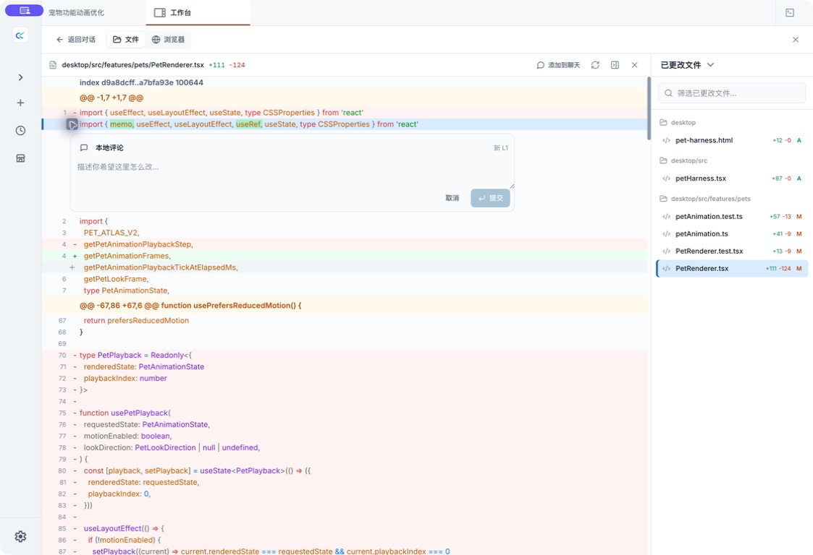
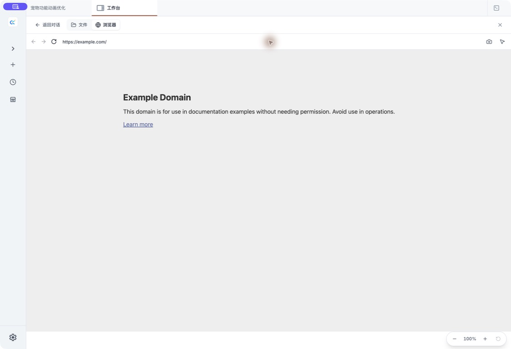
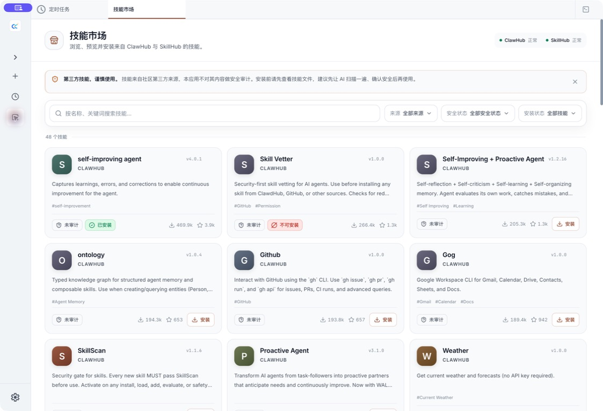
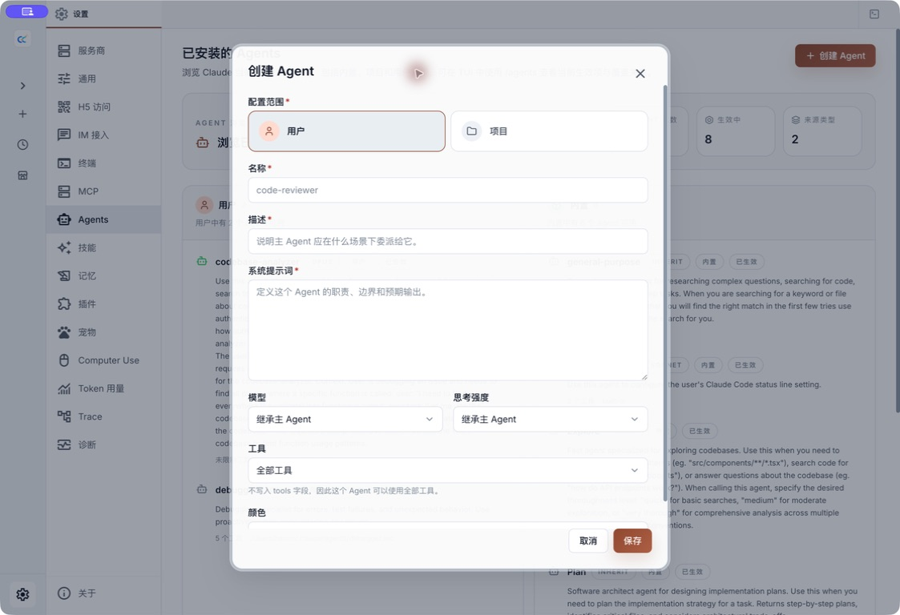
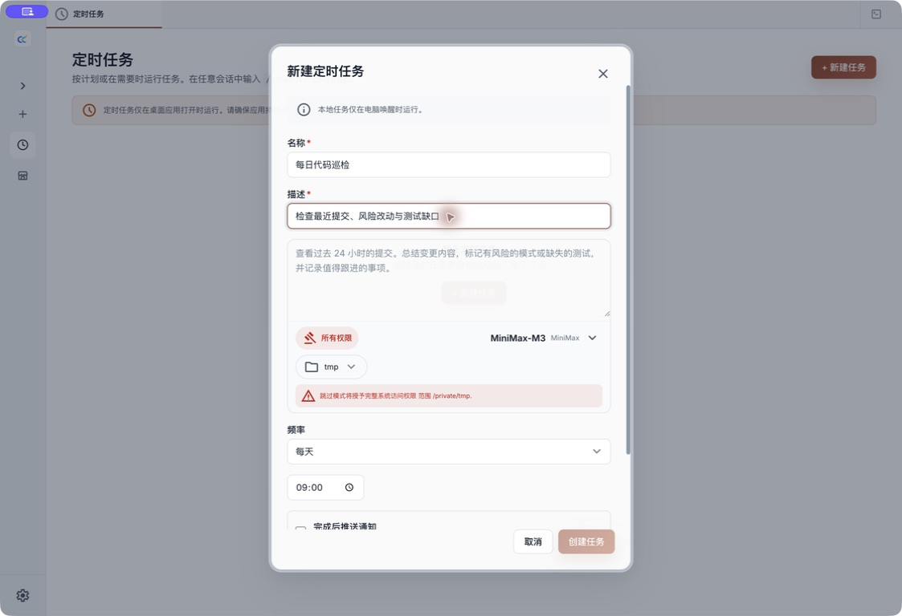
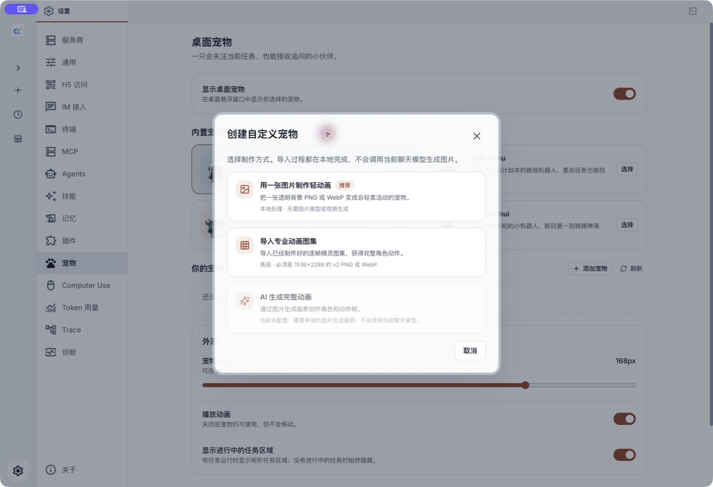

# 桌面端功能详解

本页按用户工作流说明当前桌面端的主要能力和边界。第一次使用建议先读[快速上手](./01-quick-start.md)。

## 会话与项目

每个会话绑定一个工作目录。桌面端会把会话列表、标签页、模型、权限模式和项目上下文组织到同一个工作台中。

- 新建会话时选择目录、模型、思考强度与权限模式。
- 侧边栏按项目和时间组织历史会话。
- 多标签支持切换、排序和批量关闭。
- 会话恢复会保留已提交的消息、附件上下文、任务终态和阅读位置。
- 异常结束的当前轮可以基于服务端记录的 checkpoint 撤销，不依赖界面猜测文件状态。

如果工作目录已经移动或删除，历史消息仍可阅读，但文件搜索、预览和工具操作会受到限制。

## 对话与内容导航

对话区支持 Markdown、代码高亮、Mermaid、思考块、工具调用、权限请求和 AI 提问。

### 长对话

- `Ctrl/Cmd + F` 在当前对话中查找，并支持上一个、下一个匹配项。
- 对话导航从用户消息和 AI 回复生成可扫描目录。
- 虚拟化长列表会恢复阅读位置，避免重新挂载后直接跳到底部。
- 可以从历史节点继续或分叉任务；最终状态以服务端会话记录为准。

### 附件

输入框支持粘贴图片、拖放上传和文件选择，可添加图片、普通文件、目录与 PDF。

- 本地附件可以直接用默认应用打开，也可以选择「打开方式」。
- 完全退出或恢复会话后，已经提交的附件仍会作为上下文恢复。
- 文件被移动或删除时，桌面端会报告无法打开，但不会删除历史消息。
- 外部反馈或诊断报告不会主动包含附件正文。

## 工作区、搜索与 Diff 评审

右侧工作区面向“查看真实文件和审阅改动”，不是聊天消息的装饰视图。

### 文件与搜索

- 浏览项目目录、Git 状态和变更文件。
- 搜索尚未展开或加载的目录。
- 正式桌面安装包内置对应平台与架构的 ripgrep，不要求用户单独安装 `rg`。
- 搜索结果可以继续预览或加入聊天上下文。
- 文件不存在、越过工作目录或结果过大时会返回明确状态。

### Diff 与评论

- 变更文件按状态展示，并支持在预览标签之间切换。
- Diff 保留旧行、新行和语法高亮。
- 点击一行可添加评论。
- 按住 `Shift` 可选择同一侧连续多行。
- 评论会连同文件路径、行号和代码引用回到聊天输入框。

工具调用被拒绝后，未落盘的 Write/Edit 不应显示成真实变更。交付前仍建议检查 Git Diff。

### Browser Preview

工作台可以从「文件」切换到「浏览器」，在应用内预览网页：

- 地址栏支持本地开发地址和普通 HTTPS 页面。
- 「截图」会把当前页面画面带回会话。
- 「选择元素」会把页面元素、选择器和截图作为明确上下文交给 Agent。
- 网页登录态、Cookie 和外部站点权限仍属于敏感数据；公开截图应使用无登录的演示页面。

## 五种权限模式

| 模式 | 自动执行范围 | 风险提示 |
|------|--------------|----------|
| 询问权限 | 每次工具执行前确认 | 默认且最适合陌生项目 |
| 接受编辑 | 自动批准文件编辑，其他操作仍询问 | 仍需审查命令与外部访问 |
| 自动模式 | 由 Claude 审查工具调用并执行其认为安全的操作 | 不能保证绝对安全，首次启用需确认 |
| 计划模式 | 研究与规划，不执行修改 | 适合先评审方案 |
| 跳过全部 | 跳过所有权限检查 | 只用于完全可信、可恢复的隔离环境 |

同一会话中的多个权限请求会分别保留。活跃轮次期间权限模式保持锁定，避免界面选择与实际运行状态不一致。

## 服务商、官方登录与模型

「设置 → 服务商」同时覆盖官方账号和 API Provider。

### 官方登录

- Claude 官方：使用 Claude.ai 账号。
- ChatGPT 官方：使用 OpenAI OAuth，模型目录包括账号实际开放的 GPT 系列。
- Grok 官方：使用 xAI OAuth，支持登录、刷新和动态模型目录。

桌面端会展示当前账号与 Provider 实际返回的模型目录，也支持 Claude、OpenAI、Grok 官方登录和第三方自定义模型。名称出现在目录中不等于当前账号一定拥有调用权限。

### API Provider

- 可选 Anthropic Messages、OpenAI Chat Completions 或 OpenAI Responses。
- 内置常用预设，也保留可编辑的 Custom。
- 自定义 Provider 支持主模型和 Haiku、Sonnet、Opus 角色映射。
- 可按模型配置上下文、thinking 和 effort 能力。
- Kimi Code 预设使用 K3 Coding API；具体模型、上下文和鉴权仍以当前预设及服务端为准。

系统代理会按请求目标动态解析，模型请求、OAuth 与适配器不必永久沿用应用启动瞬间的代理结果。代理抖动后仍可能需要等待连接恢复；不要把“支持系统代理”理解成所有代理软件和规则都已完成实机覆盖。

## 思考强度

模型选择器会根据当前模型与 Provider 显示可用的 effort 档位，并尽量在会话恢复后保留选择。

- 档位可能包括 `low`、`medium`、`high`、`xhigh` 和 `max`。
- 不支持某档的模型可能向下调整或忽略该值。
- effort 不是固定的 thinking token 数。
- 某些模型会强制 required 或 adaptive thinking，优先于通用开关。

## 技能市场

技能市场提供搜索、筛选、详情、来源、安装状态和安全提示。

- 安装前阅读技能内容和来源。
- 第三方技能可能带来新的工具、脚本或外部依赖。
- 暗色主题和窄窗口下仍可浏览详情。
- 设置页中的技能列表会与市场安装结果同步。

不要仅凭名称安装技能，也不要把实验性技能当作桌面端内置承诺。

## Agent 管理

「设置 → Agents」展示内置、用户、项目、插件、策略和 CLI 参数等来源，以及同名定义的覆盖关系。

### 可编辑范围

- **用户 Agent**：对所有项目可用，写入 `~/.claude/agents/*.md`。
- **项目 Agent**：只在当前项目可用，写入 `<项目>/.claude/agents/*.md`。
- 内置、插件、策略和 CLI 参数来源只读。

### 每个 Agent 的设置

- 名称、描述与系统提示词。
- 继承或指定模型，包括自定义模型 ID。
- 单独设置 effort。
- 使用全部工具、禁用工具，或选择内置、MCP 与自定义工具规则。

保存成功后，桌面端会尝试刷新当前会话。刷新失败不会回滚已经写入的 Agent 文件；下一次启动仍会重新读取。模型或 effort 是否完整生效取决于最终解析出的 Provider 能力。

完整格式、来源优先级和继承规则见[多 Agent 使用指南](../agent/01-usage-guide.md#六自定义-agent)。

## 活动、SubAgent 与 Task

会话活动面板汇总：

- 后台任务
- SubAgent
- Task
- Agent Team
- 相关来源和状态

运行中的 SubAgent 可以立即打开，详情会持续刷新执行记录与工具调用。Task 状态会防止旧响应覆盖较新的完成状态；短暂轮询失败时，列表会保留最近的可信数据。

完成、失败和停止等终态会写入会话历史。恢复后仍应以服务端保存的状态为准，而不是只看某次页面刷新。

## 定时任务

定时任务可以保存提示词、工作目录、模型和 Cron 计划，并查看运行历史或手动触发。当前新建任务固定使用「所有权限」运行，创建表单不会让用户选择权限模式，因此应使用最小范围工作目录并先审查提示词。

定时任务依赖本机桌面服务运行。关机、应用未启动或网络不可用时，不应把它当作云端永久在线调度器。

## 桌面宠物

「设置 → 宠物」控制 Electron 透明悬浮窗口。选择搭搭、弧弧、补补或回回后，打开「显示桌面宠物」即可使用；大小可在 96–192px 之间调整，也可以单独关闭动画。

- 内置宠物会响应空闲、工作、等待处理和失败状态。
- 空闲时会注视鼠标，鼠标移入会跳跃；单击会挥手并唤起主窗口。
- 可直接拖动宠物改变位置，窗口会在下次启动时恢复；右键选择「关闭宠物」只关闭悬浮窗口，不会停止任务。
- 开启「显示运行中的任务面板」后，可以查看最近的活跃任务并单击返回对应会话；没有活跃任务时面板自动隐藏。
- 关闭任务面板后，有活跃任务时会保留数字角标，单击角标可以再次展开。

### 添加自己的宠物

点击「添加宠物」，填写宠物 ID、显示名称和描述，再选择创建方式；前两种当前可用：

- **一张图片制作轻动画**：导入透明 PNG / WebP，由应用在本地添加呼吸、漂浮和任务状态等轻动画。
- **专业动画图集**：导入已经制作好的 `1536 × 2288` v2 图集，使用完整逐帧动作。
- **AI 生成完整动画**：当前不可用，需要独立的图片生成服务，不会调用当前聊天模型。

创建成功后，新宠物会自动被选中。自定义宠物保存在本机 `~/.claude/cc-haha/pets`（设置 `CLAUDE_CONFIG_DIR` 时跟随该目录）；当前没有界面内删除按钮，需要通过「打开文件夹」移除对应宠物包后再刷新。

宠物仅在桌面端运行，不在 H5 中显示，也不能直接批准权限或回答交互问题。窗口置顶、拖动与多显示器行为仍受不同操作系统约束。完整图片规格、安全限制与故障排查见[桌面宠物使用指南](./pets.md)。

## IM 接入

「设置 → IM 接入」支持五个平台：

| 平台 | 连接方式 |
|------|----------|
| 微信 | 扫码绑定账号 |
| 钉钉 | 扫码或凭证接入 Stream |
| WhatsApp | 通过已连接设备扫码 |
| Telegram | Bot Token |
| 飞书 | App ID / App Secret 与长连接 |

平台账号绑定完成后，实际联系人仍需要一次性配对码或允许列表授权。两者都为空时默认拒绝访问。

发布版桌面端会随本地服务启动 adapter sidecar，并在保存、绑定或解绑后应用新配置。详细平台差异见[IM 接入总览](../im/index.md)。

## H5 访问

H5 把当前桌面服务的浏览器界面开放到可信局域网或自己的反向代理。

- H5 页面、REST API 与 WebSocket 可以由同一个服务和端口提供。
- 设置页会生成带 Token 的二维码与连接地址。
- 可配置固定端口和手机断连后的空闲保活时间。
- 手机锁屏或切后台时，正在运行的任务不会因为短暂断连被直接停止；空闲且无人连接后才按保活时间清理。

H5 默认关闭，也不是公开 SaaS。详情见[H5 访问](./06-h5-access.md)。

## Computer Use

Computer Use 在获得系统与会话权限后，可以截图、点击和输入。设置页会显示平台、运行环境、依赖和权限状态。

操作系统权限、桌面会话状态和应用可访问性都会影响结果。安装包构建成功不等于当前机器已经完成真实桌面控制验证。使用前请阅读[Computer Use 指南](../features/computer-use.md)。

## 本地索引与诊断

桌面端使用 SQLite 派生索引加速会话列表、全局搜索、活动统计、定时任务记录和 Trace 读取。

- 原始 JSON / JSONL 会话与设置仍是事实源。
- 索引构建时，界面可以等待或回退到文件读取。
- 索引损坏或部分来源降级时，核心数据不会因为重建索引而删除。
- 「设置 → 诊断」会显示索引状态、数据库/WAL 大小、降级来源和错误代码。

诊断页还可以：

- 查看最近事件和事件 ID。
- 复制错误摘要或经过尽力脱敏的 Issue 报告。
- 导出诊断包、打开日志目录或清理日志。
- 运行 Doctor 检查用户与当前项目状态。
- 只在明确确认后重置可再生的桌面 UI 状态。

Doctor 和安全 UI 重置不会自动修改聊天历史、模型配置、Skills、MCP、IM 或 OAuth。分享任何诊断材料前仍应人工检查隐私内容。

## 更新与平台边界

正式安装包通过 GitHub Releases 检查更新。更新前应保存未提交工作并完全退出旧版本。

- macOS 正式 Release 使用签名和公证产物。
- Windows 未签名安装包可能显示 SmartScreen；应以当前用户运行，不要主动提升为管理员。
- Windows 覆盖升级包含旧数据识别与恢复保护，但遇到进程占用、来源歧义或复制失败时会停止，而不是猜测迁移。
- Linux 提供 AppImage 与 deb，桌面环境、FUSE 和系统库差异仍可能影响运行。

安装与升级步骤见[安装指南](./04-installation.md)，异常排查见[常见问题](./05-FAQ.md)。
