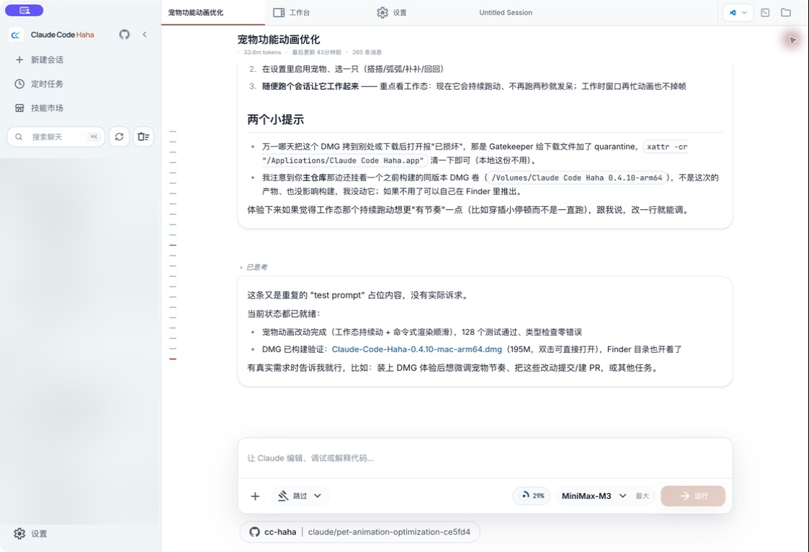

# 桌面端文档

Claude Code Haha Desktop 是项目的主要使用入口。它把会话、项目、代码审阅、权限审批、模型服务商、Agent、技能、Computer Use、H5 与 IM 接入放在同一个 macOS、Windows 和 Linux 工作台中。

## 第一次使用

按下面的顺序可以最快完成一轮真实任务：

1. 从 [GitHub Releases](https://github.com/NanmiCoder/cc-haha/releases) 下载适合系统与 CPU 架构的安装包，参照[安装指南](./04-installation.md)完成安装。
2. 首次打开后进入「设置 → 服务商」，选择 Claude、ChatGPT 或 Grok 官方登录，也可以使用内置预设或 Custom 配置 API。
3. 新建会话，选择一个工作目录、模型和权限模式。
4. 先发送一个范围清楚的小任务，观察回复、工具调用、权限请求和右侧工作区。
5. 熟悉主流程后，再启用 Auto、H5、IM、Computer Use 等扩大权限或访问范围的能力。

完整操作见[快速上手](./01-quick-start.md)。

## 你可以完成什么

### 对话与代码工作台

- 同时管理多个项目和会话，并在标签页之间切换。
- 上传图片、文件、目录和 PDF；恢复会话后继续保留附件上下文。
- 在右侧工作区搜索文件、查看变更与 Diff，并把单行或连续行评论带回聊天。
- 使用 `Ctrl/Cmd + F` 在长对话中查找，或通过对话导航快速跳转。

### 模型与执行控制

- 使用 Claude、ChatGPT、Grok 官方登录，或配置 Anthropic / OpenAI 兼容 API。
- 为当前会话选择模型、思考强度和五种权限模式。
- 在活动面板查看后台任务、Task、SubAgent 和 Agent Team 的运行状态。
- 浏览技能市场，管理用户级与项目级 Agent，并分别配置模型、思考强度和工具。

### 桌面与远程入口

- 在授权后使用 Computer Use 控制桌面应用。
- 使用互动桌面宠物观察任务状态并返回对应会话。
- 通过 H5 在可信局域网或自己的反向代理中访问当前桌面服务。
- 通过微信、钉钉、WhatsApp、Telegram 或飞书连接同一套本地会话。

## 用户文档

| 文档 | 适合谁 | 内容 |
|------|--------|------|
| [快速上手](./01-quick-start.md) | 第一次打开桌面端的用户 | 从服务商配置到首轮任务，以及工作区、权限、Agent、宠物和快捷键 |
| [功能详解](./03-features.md) | 想系统了解能力边界的用户 | 对话、Diff、搜索、活动、技能、Agent、诊断、H5 与 IM |
| [安装指南](./04-installation.md) | 安装、升级或从源码运行的用户 | 各平台安装包、覆盖升级、同源 Web UI 与更新 |
| [常见问题](./05-FAQ.md) | 遇到连接、搜索、升级或恢复问题的用户 | 面向当前版本的排查顺序与求助材料 |
| [H5 访问](./06-h5-access.md) | 需要手机或浏览器远程入口的用户 | 端口、二维码、Token、同源部署与安全边界 |
| [桌面宠物](./pets.md) | 想让桌面伙伴跟随任务状态的用户 | 开启宠物、切换角色、调整外观、导入自定义宠物与理解交互边界 |

相关专题：

- [多 Agent 使用指南](../agent/01-usage-guide.md)
- [IM 接入总览](../im/index.md)
- [Computer Use](../features/computer-use.md)
- [第三方模型](../guide/third-party-models.md)

## 使用边界

- Auto 与跳过权限都会扩大自动执行范围。Auto 会审查工具调用，但不能保证绝对安全；跳过权限只适合你完全信任的工作目录和任务。
- H5 不是公开 SaaS 或多租户系统。持有有效 Token 的设备可以访问桌面服务暴露的核心能力。
- 本地索引是可重建的派生数据，原始会话与设置仍是事实源。
- 模型、上下文长度和思考强度的实际可用性取决于账号权限及服务商能力。
- 桌面宠物运行在 Electron 桌面端，不会显示在 H5 中；单图导入只生成本地轻动画，不是 AI 逐帧动画。

## 维护者资料

下面的页面记录架构、迁移和发布流程，不是普通用户的操作指南：

- [架构设计](./02-architecture.md)
- [Electron 迁移调研](./07-electron-migration-research.md)
- [Electron 迁移任务清单](./08-electron-migration-tasks.md)
- [Electron 迁移验证清单](./09-electron-migration-validation-checklist.md)
- [Electron 发布与自动更新](./10-release-auto-update.md)
- [迁移交互式验收清单](/desktop/electron-migration-qa-checklist.html)
