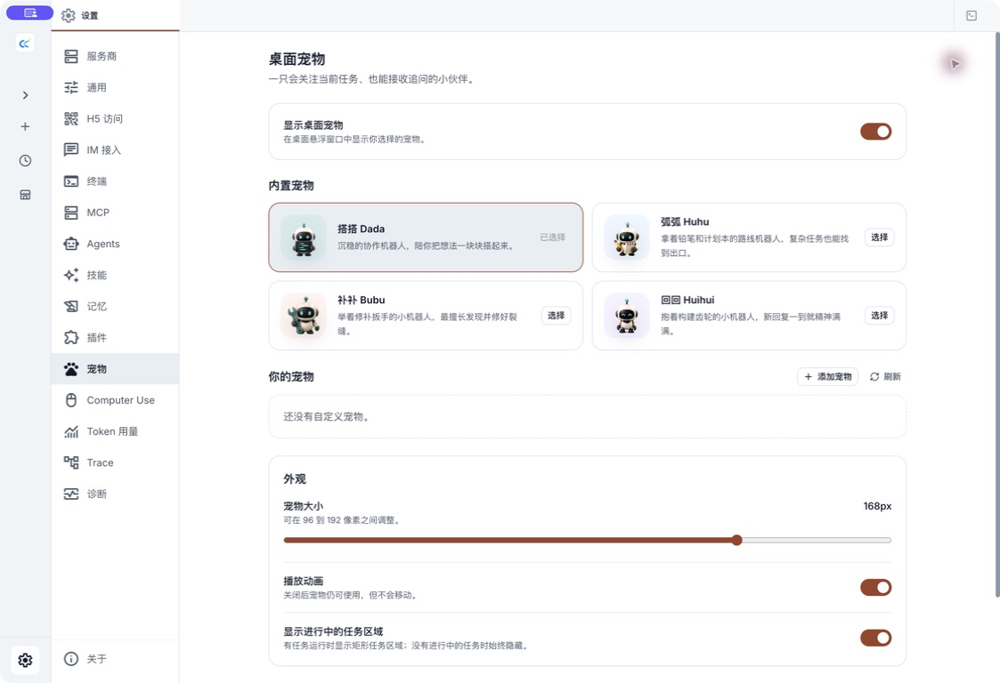
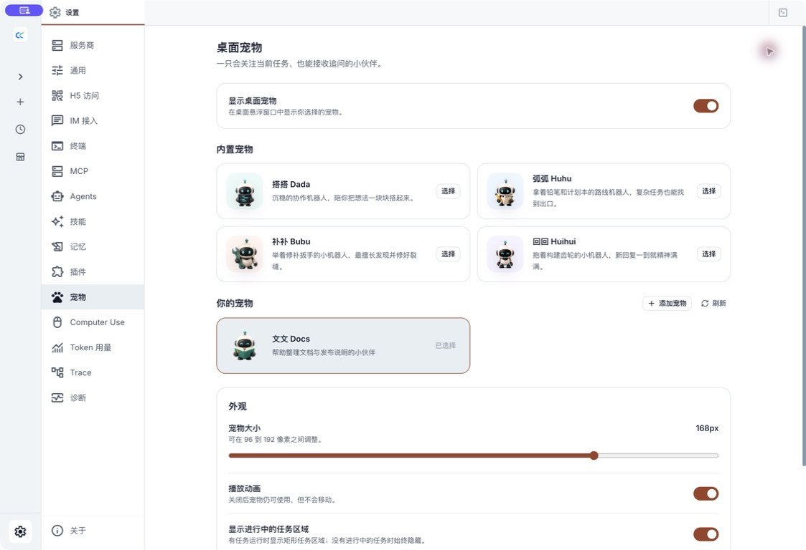

# 桌面宠物

桌面宠物是 Claude Code Haha Desktop 的透明悬浮窗口。它会用动作反映本机任务状态，并提供一个轻量的活跃任务入口。宠物不会替你审批权限，也不能在悬浮窗口里直接输入追问。

::: info 适用范围
宠物只在 Electron 桌面端运行，不会显示在 H5 页面中。它不会扩大当前会话、模型或工具的权限。
:::

## 开启宠物

1. 打开 Claude Code Haha Desktop，点击左下角的设置按钮。
2. 在设置侧边栏选择「宠物」。
3. 从「内置宠物」中选择一个角色。
4. 打开「显示桌面宠物」。
5. 按需要调整宠物大小、动画和任务面板。



应用内置四个完整动画角色：

| 角色 | 特点 |
|------|------|
| 搭搭 Dada | 沉稳的协作机器人 |
| 弧弧 Huhu | 拿着铅笔和计划本的路线机器人 |
| 补补 Bubu | 举着修补扳手的修复机器人 |
| 回回 Huihui | 抱着构建齿轮的构建机器人 |

选择新角色后，已经打开的宠物窗口会同步更新。关闭「播放动画」只会停止动作，不会关闭宠物或任务入口。

## 和宠物互动

宠物窗口支持这些直接操作：

- **悬停**：宠物空闲时会跳跃，并跟随指针改变视线。
- **单击宠物**：唤起 Claude Code Haha 主窗口，同时播放挥手动作。
- **拖动宠物**：按住宠物本体移动到桌面的其他位置；重新打开应用后会尽量恢复上次位置。
- **右键宠物**：在系统菜单中选择「关闭宠物」。
- **重新打开**：回到「设置 → 宠物」，重新打开「显示桌面宠物」。

单击宠物只会唤起主窗口，不会自动进入某条会话。要返回具体任务，请使用宠物旁边的任务面板。

## 查看活跃任务

开启「显示进行中的任务区域」后，有活跃任务时，宠物旁边会出现任务面板。关闭这个选项时，活跃任务会收起为数字徽标；点击徽标即可展开。

面板会反映当前仍需要关注的本机会话，例如：

- **工作中**：会话、后台任务或 Agent 正在运行。
- **等待你处理**：会话正在等待权限审批或其他用户操作。
- **需要关注**：会话最近一次运行失败或出现错误。

点击任务行会唤起主窗口并返回对应会话。权限仍要在主窗口的会话界面中检查和批准，宠物本身不能批准或拒绝权限。

任务完成并回到空闲状态后，会从活跃任务面板中消失；这不代表会话或历史记录被删除。面板只显示最近的活跃会话，不是完整的会话列表。

## 添加自定义宠物

在「你的宠物」右侧点击「添加宠物」，可以选择两条本地导入路径。


无论选择哪种方式，都需要填写：

- **宠物 ID**：最多 73 个字符，只使用小写字母、数字和单个连字符，例如 `docs-bot`。
- **显示名称**：在宠物列表中显示的名称。
- **宠物描述**：帮助你区分不同角色和用途。

创建成功后，新角色会出现在「你的宠物」中并被自动选中。



### 用一张图片制作轻动画

这是普通用户最容易使用的方式。选择一张透明背景的静态 PNG 或 WebP，应用会在本地添加呼吸、漂浮和任务状态等轻动画。

图片需要满足：

- 文件格式为静态 PNG 或 WebP，不支持 APNG 或动态 WebP。
- 宽和高都在 `32–4096` 像素之间。
- 总像素数不超过 `16,777,216`。
- 文件大小不超过 `8 MB`。

单图轻动画不是 AI 生成的逐帧动画，也不会调用当前聊天模型。

### 导入 v2 动画图集

已经制作好完整动作帧时，可以导入 v2 动画图集。图片必须满足：

| 项目 | 规格 |
|------|------|
| 格式 | 静态、透明背景的 PNG 或 WebP |
| 总尺寸 | 精确为 `1536 × 2288` |
| 网格 | `8` 列 × `11` 行，无单元格间距 |
| 单格尺寸 | `192 × 208` |

动作行的顺序依次是：待机、向右跑、向左跑、挥手、跳跃、失败、等待、工作、复核，以及最后两行的 16 个视线方向。

「复核」行属于图集格式的预留动作，不代表当前运行时会自动显示一个独立的复核状态。

尺寸、格式或图像内容不符合要求时，应用会拒绝创建并显示对应错误，不会把无效图片加入宠物列表。

### AI 生成为什么不可选

「AI 生成完整动画」目前只是预留入口，需要单独配置图片生成服务，当前版本还不能在这里直接使用。它不会自动调用当前会话选择的 Claude、ChatGPT、Grok 或其他聊天模型。

## 存储与删除

自定义宠物包默认保存在：

```text
${CLAUDE_CONFIG_DIR:-~/.claude}/cc-haha/pets
```

可以在宠物设置页底部点击「打开文件夹」查看实际目录。每只自定义宠物使用独立子目录，其中包含 `pet.json` 和对应图片。

当前设置页没有自定义宠物删除按钮。需要删除时：

1. 先在设置页选择一个内置宠物，避免继续使用准备删除的角色。
2. 点击「打开文件夹」。
3. 只删除目标宠物对应的子目录，不要删除整个 `~/.claude`、`cc-haha` 或 `pets` 目录。
4. 返回设置页点击「刷新」。

手工修改 `pet.json`、替换图片或加入符号链接可能使宠物包校验失败。无效包会被跳过，并在设置页显示提示。

## 使用边界

- 宠物读取的是当前桌面服务中的任务状态，不是云端常驻监控。
- 退出 Claude Code Haha 或本机休眠后，宠物不能继续运行任务。
- 宠物只提供状态提示和会话跳转，不能审批权限、发送追问或替代完整活动面板。
- 自定义图片导入在本机完成，但之后由你主动运行的会话、模型和集成仍遵循各自的数据与权限边界。
- H5 可以继续访问对话主流程，但不会显示或远程控制桌面宠物。

如果宠物没有出现，先确认「显示桌面宠物」已经开启，再完全退出并重新打开应用。导入失败时，优先核对图片格式、尺寸、文件大小和宠物 ID。
