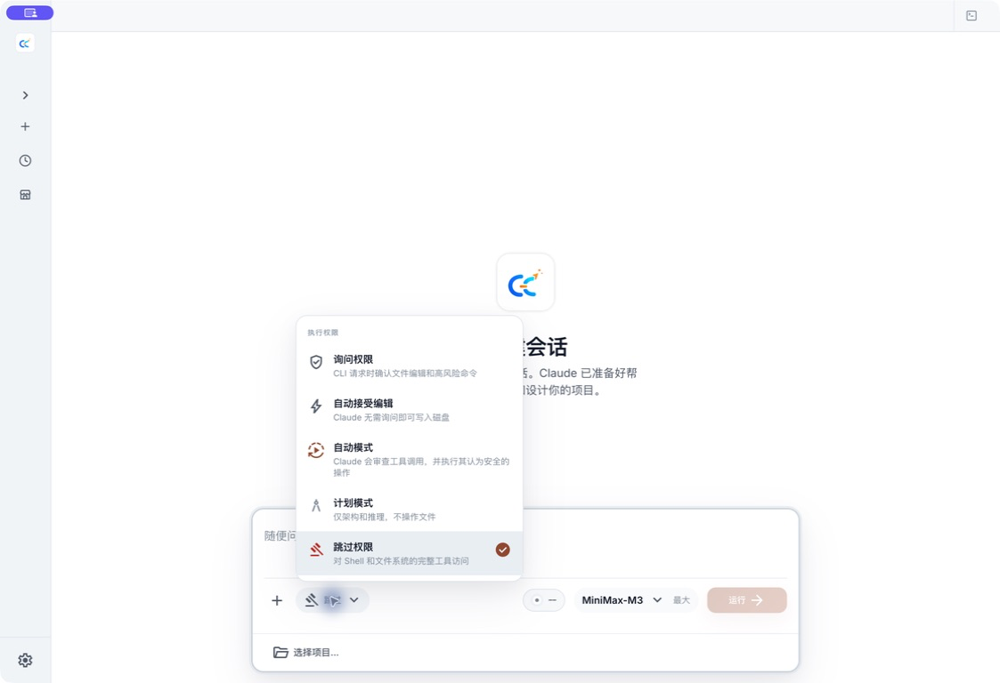
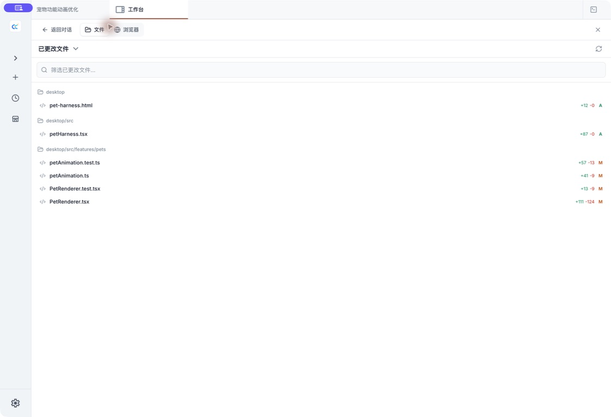

# Desktop Feature Guide

This page summarizes the current user-visible Desktop surface.

## Sessions and chat

- Multiple tabs and project-filtered session history
- Streaming Markdown, code, Mermaid, tool calls, thinking blocks, and permission requests
- Image, file, directory, and PDF attachments with context preserved across restart and resume
- Slash commands, `@` file search, model selection, and supported reasoning-effort levels
- Stop, resume, search, navigation outline, and checkpoint-based undo for the current turn
- Restored scroll position and stable search in long, virtualized conversations

## Permission controls

Desktop supports Ask, Accept Edits, Plan, Auto, and Bypass Permissions. Auto evaluates operations according to its policy; Bypass skips only approvals that are eligible to be skipped. Explicit denials, protected boundaries, and tools that require direct user interaction remain enforced.

The selected mode is visible in the session composer. Higher-autonomy modes require an explicit warning confirmation.

## Workspace and code review

The workspace panel combines:

- full-project file search using the packaged ripgrep binary;
- a file tree, previews, and external-editor actions;
- changed-file summaries and inline diffs;
- single-line or contiguous-line review comments sent back into chat;
- embedded terminal and local browser preview.

Branch and Current/Isolated Worktree selection belongs to the new-session launch controls. The workspace then shows the selected session's files, Git status, and diffs.

### Browser Preview

Switch the workbench from **Files** to **Browser** to open a local development page or HTTPS URL inside the app.

- **Screenshot** sends the current page image back to the session.
- **Select element** captures a page element, selector, and screenshot as explicit Agent context.
- Treat authenticated pages, cookies, and external-site content as sensitive. Use a public demo page for documentation screenshots.

## Tasks, SubAgents, and activity

The activity panel collects foreground tasks, background tasks, SubAgents, team members, and sources without flooding the main transcript.

Running SubAgents can be opened before they finish. Their status, output, tool activity, duration, and terminal state continue to refresh. Completed, failed, and stopped terminal states are persisted so they do not revert to “running” after restart.

Scheduled tasks support cron-based runs, model selection, enable/disable controls, manual execution, notifications, and history. New scheduled tasks currently run with Bypass Permissions; the form does not provide a permission selector. Use the smallest practical working directory and review the prompt before saving. Tasks run only while the Desktop app and computer remain available.

## Providers and models

Provider settings support:

- Claude, OpenAI, and Grok official login;
- editable built-in presets;
- Custom Anthropic, OpenAI Chat, and OpenAI Responses endpoints;
- per-provider model mappings, context metadata, proxy mode, and supported effort levels;
- connection testing and runtime model discovery where available.

The visible model catalog and supported effort levels depend on the current account, provider, and runtime response. Release-specific model names belong in release notes rather than this evergreen guide.

## Skills and marketplace

The Skills area groups local Skills by source and exposes their metadata and files. The marketplace aggregates supported third-party sources with search, filters, details, file previews, installation confirmation, local installation state, and risk information.

Marketplace metadata is not a security guarantee. Review the source and requested behavior before installing a Skill.

## Agent management

The Agents page shows built-in, user, project, plugin, and policy sources together with override and effective-state information.

Editable user and project Agents support:

- reusable user scope or current-project scope;
- model inheritance or an explicit model ID;
- supported effort from `low` through `max`;
- searchable tool selection plus custom and MCP tool rules;
- a system prompt and description.

User Agents are stored in `~/.claude/agents/`, while project Agents are stored in the current project's `.claude/agents/`. Built-in, plugin, and policy definitions remain read-only. Saving a definition and refreshing a running session are separate outcomes; a refresh failure does not silently discard a saved file.

## Desktop pets

The optional pet window is a native transparent Electron surface. Open **Settings → Pets**, enable the window, and choose one of the four built-in companions: Dada, Huhu, Bubu, or Huihui.

The pet reflects working, waiting-for-you, failed, and idle states. While a task is active, its task panel can show the session title and status; selecting a row returns to that session. The panel remains hidden when no task is active. If automatic display is disabled, an activity-count badge lets you open it when work is running.

The window also supports direct interaction:

- hover to trigger a small reaction and idle gaze tracking;
- click to wave and focus the main window;
- drag to move the window, with its position restored after restart;
- right-click to close it, then use **Settings → Pets** to show it again.

### Add a custom pet

Select **Add pet** to choose a local creation path.

- **Animate one image** turns a static transparent PNG or WebP into a lightweight locally animated pet.
- **Import professional animation atlas** accepts the supported `1536×2288` v2 sprite-sheet format.
- **Generate full animation with AI** is visible for context but is currently unavailable.

Imports stay local and do not call the selected chat model. After a successful import, the custom companion appears under **Your pets** and becomes the selected pet.

Size, animation, active-task-panel, and window-position preferences are restored between launches. Pets run only in the Electron desktop app and are not supported in H5. See the [Desktop Pet Guide](./pets.md) for image limits, atlas layout, storage, and troubleshooting.

## Local data and search

A rebuildable SQLite projection accelerates session lists, global search, activity statistics, scheduled runs, teams, and traces. Original JSON and JSONL files remain authoritative. If the index is unavailable or damaged, readers can fall back to source files, and Diagnostics provides a confirmed rebuild action.

Rebuilding the index does not delete chats, settings, Skills, memory, tasks, or traces.

## IM and H5

The desktop can launch sidecar adapters for WeChat, DingTalk, WhatsApp, Telegram, and Feishu. Each platform is private-chat oriented and requires an allowlisted or paired user. See [IM Integrations](../im/).

[H5 Access](./06-h5-access.md) serves the browser UI from the local server for a trusted LAN or controlled reverse proxy. It uses a separate token and origin policy and is not a public multi-user account system.

## Diagnostics and recovery

Diagnostics surfaces local-index health, sidecar and runtime information, fallback state, storage information, and safe rebuild actions. Startup failures that cannot be recovered automatically should remain visible rather than leaving only a background process.

Doctor and repair flows are intentionally conservative: protected user data is not silently reset.
