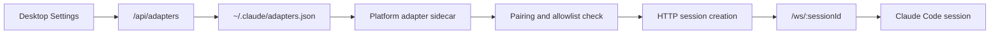

# IM Integrations

Claude Code Haha can bridge private messages from WeChat, DingTalk, WhatsApp, Telegram, and Feishu into local Desktop sessions.

These integrations do not make the local agent public. A user is accepted only when they are explicitly listed in `allowedUsers` or have completed pairing.

## Current architecture

The supported path is the Desktop adapter architecture:

Platform adapters are separate local processes. They read their platform configuration, enforce authorization, map a private chat to a project session, and bridge messages over the Desktop server.

This is different from the upstream Claude Code Channel/MCP research retained under [Channel System](../channel/).

## Set up an integration

1. Keep the Desktop app running.
2. Open **Settings → IM Integration**.
3. Configure or bind one platform.
4. Set a default project if desired.
5. Generate a six-character pairing code.
6. Send the code in a private chat with the bot or bound account.

The code expires after 60 minutes, can be used once, and is invalidated when a new code is generated. Repeated failures are rate limited.

## Platforms

- [WeChat](./wechat.md) — QR-bound bot account, private chats
- [DingTalk](./dingtalk.md) — DingTalk Stream, private chats
- [WhatsApp](./whatsapp.md) — personal linked-device session through WhatsApp Web
- [Telegram](./telegram.md) — BotFather token, private chats
- [Feishu](./feishu.md) — enterprise custom app, `p2p` chats

## Local state

`~/.claude/adapters.json` stores platform configuration, allowlists, and pairing state. Sensitive fields returned by the settings API are masked.

`~/.claude/adapter-sessions.json` stores chat-to-session mappings, including the session ID, working directory, and update time. This allows an adapter to reconnect to an existing session after restart.

Both paths follow `CLAUDE_CONFIG_DIR` when a custom data directory is active.

## Authorization model

- `allowedUsers` and `pairedUsers` are combined.
- If both are empty, access is denied.
- Binding a bot or linked account does not authorize its contacts.
- Removing a paired user requires that user to pair again.
- Removing platform credentials stops that platform from connecting.

## Common commands

The exact presentation differs by platform, but adapters support the same core operations:

- `/help` — show available commands
- `/status` — show the current project, model, and run state
- `/projects` — list or switch recent projects
- `/new` — start a new session or choose another project
- `/clear` — clear current context while keeping the project binding
- `/stop` — stop the current generation

Permission requests are returned as platform buttons, cards, or explicit text commands. A request ID must match the pending Desktop session request.

## Development

Packaged Desktop starts configured adapter sidecars automatically. Manual `bun run <platform>` commands are for source development and isolated troubleshooting.
