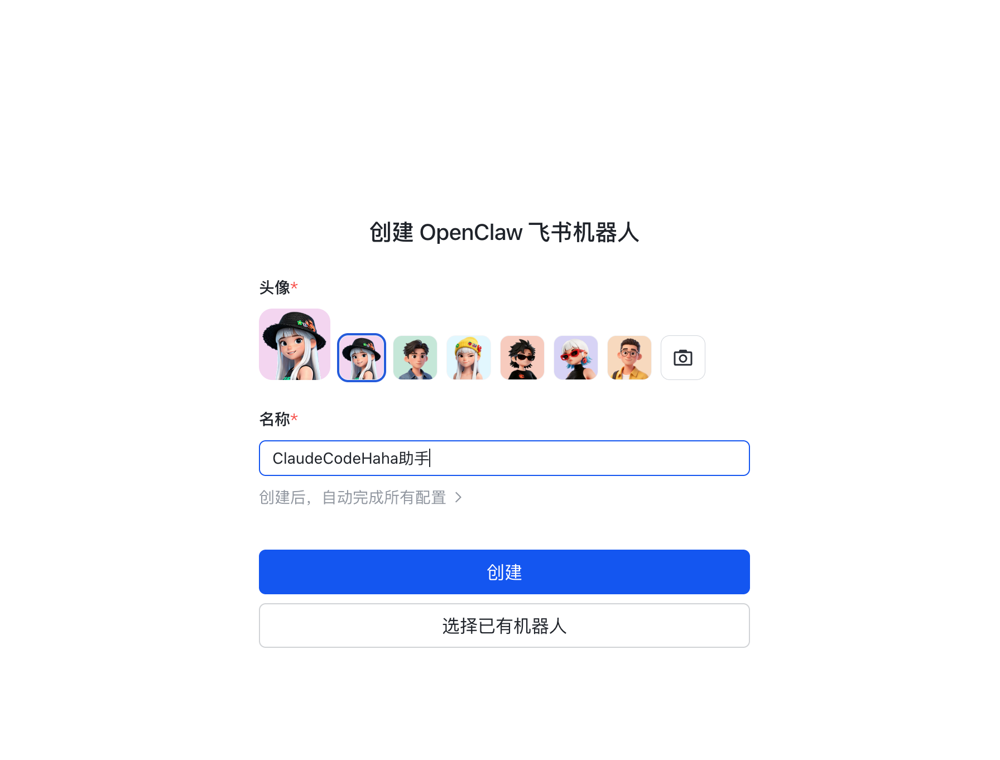
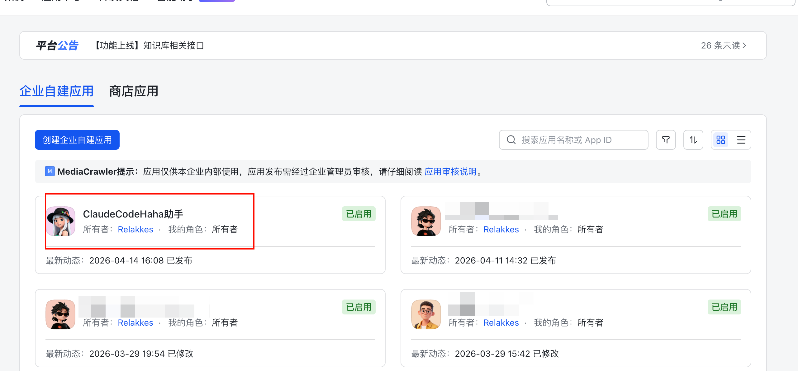
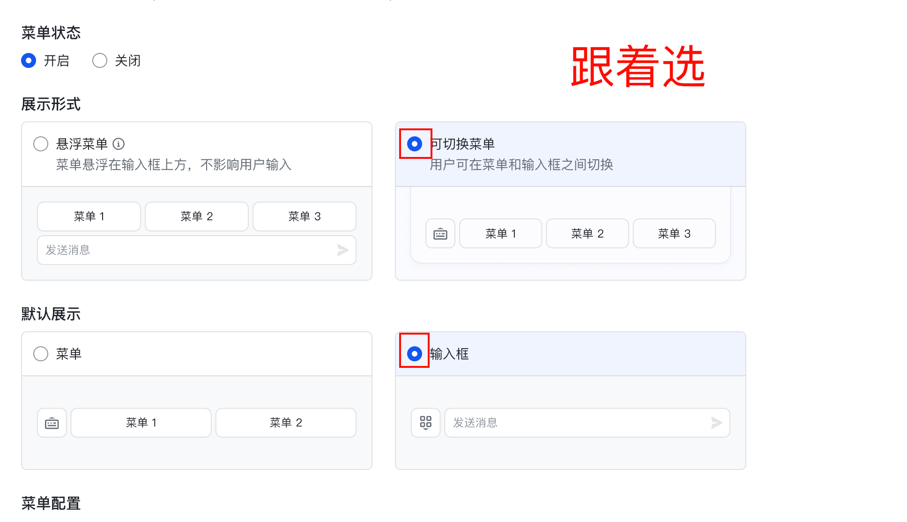
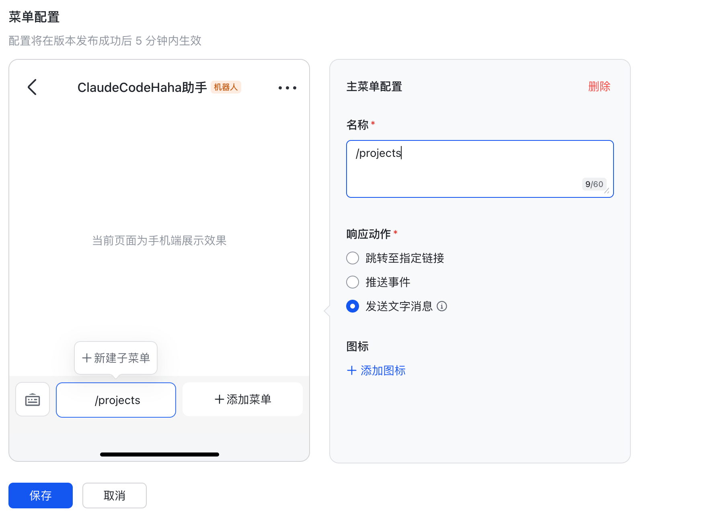
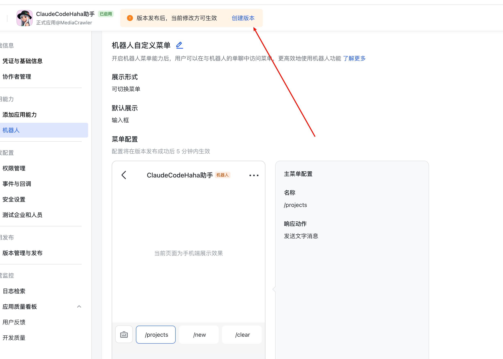
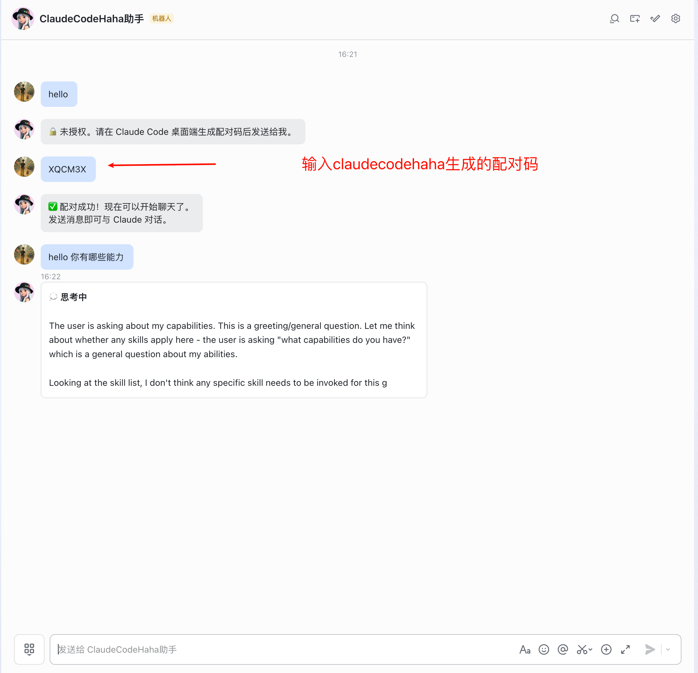

# 飞书接入

> 飞书 Adapter 的接入教程。官方已经提供了**预配好权限的模板机器人**，跟着下面几步点一点就能完成接入。

## 适用场景

飞书方案适合在中国区环境下通过企业自建应用私聊 Claude Code。当前实现只处理 `p2p` 私聊，不处理群聊。

实现入口：`adapters/feishu/index.ts`

## 1. 一键创建飞书机器人

直接打开下面的链接创建机器人——这是官方为 OpenClaw 提前配好所有权限（消息、事件、卡片回调等）的模板，省去手动配 scope 和事件订阅：

👉 [立即创建飞书机器人](https://open.feishu.cn/page/openclaw?form=multiAgent)



随便给你自己的机器人取一个名字，点击创建：


创建成功后，把 **App ID** 和 **App Secret** 保存下来，接着去配置机器人菜单。

## 2. 配置自定义菜单（/projects /sessions /resume /new /clear）

进入[飞书开发者后台](https://open.feishu.cn/app?lang=zh-CN)，选择刚创建的机器人，进入机器人配置页：



进入「机器人菜单」开始配置：


建议添加这些常用命令：

**/projects** — 查看最近使用的项目，并在选中项目后新建会话



**/sessions** — 查看历史会话列表

**/resume** — 切换到历史会话（配合编号或 sessionId 使用）

**/new** — 开启新对话



**/clear** — 清空上下文


菜单配好后点击保存：



最后点击「创建新版本并发布」让菜单生效：


**命令作用说明：**

- `/projects`：列出最近使用的项目，选中后在该项目中新建会话
- `/sessions [项目]`：列出历史会话；可不带参数查看全部，也可带项目名筛选
- `/sessions -n` / `/sessions -p`：查看下一页 / 上一页历史会话
- `/resume <编号|sessionId>`：切换到 `/sessions` 列表中的历史会话；若 sessionId 前缀匹配到多个会话，会提示继续缩小范围
- `/new [项目]`：开启新对话；可带项目名、编号或绝对路径
- `/clear`：清空当前会话上下文

## 3. 在 Claude Code Haha 桌面端填写

### 3.1 填写 App ID / App Secret

打开桌面端 `设置 → IM 接入 → 飞书`，把前面拿到的两把钥匙填进去：


### 3.2 生成配对码

点击「生成配对码」按钮，得到 6 位码：


**记得点保存！！**

## 4. 飞书机器人与桌面端配对

随便给刚才创建的机器人发送一条消息，按提示把上一步的 6 位配对码发给它：



看到配对成功提示后，就可以用飞书在手机上远程驱动桌面端 Claude Code Haha 了：


## 支持的命令

除菜单按钮外，飞书 adapter 还支持文本命令和中文别名：

- `/help` 或 `帮助`
- `/status` 或 `状态`
- `/clear` 或 `清空`
- `/projects` 或 `项目列表`
- `/sessions [项目]`、`/sessions -n`、`/sessions -p` 或 `会话列表`
- `/resume <编号|sessionId>` 或 `切换会话`
- `/new [项目]` 或 `新会话`
- `/stop` 或 `停止`

## 权限审批

当 Claude 请求敏感权限时，adapter 会在飞书里发送交互卡片，点击「允许 / 拒绝」即可把结果回传给桌面端。

## 返回消息的表现

- 普通文本通过 `post` 消息发送
- 权限审批通过卡片发送
- 流式卡片会先显示“当前状态”，再逐步补充工具执行、思考过程和正文
- 工具执行中会显示运行中/已完成状态与汇总计数
- 完成后终态卡片只保留正文，过程态状态区不会保留
- 普通文本回退路径仍优先 patch 同一条消息
- 完成后按 30000 字左右分片

## 启动 adapter

桌面端会自动把 adapter 作为 sidecar 拉起。如果你在本地开发，需要手动启动：

```bash
cd adapters
bun install
bun run feishu
```

## 环境变量覆盖（可选）

```bash
export FEISHU_APP_ID="cli_xxx"
export FEISHU_APP_SECRET="xxx"
export ADAPTER_SERVER_URL="ws://127.0.0.1:3456"
```

## 常见问题

### 一键创建后的机器人权限够用吗？

OpenClaw 官方模板已预配 `im:message`、`im:message:send_as_bot`、`im:resource`、`im.message.receive_v1`、`card.action.trigger` 等所有所需权限，**不需要再手动去配 scope 或事件订阅**。

### 收不到消息

优先检查：

- 机器人是否已发布（菜单改完需要「创建新版本并发布」）
- 是否真的是和 bot 的私聊，而不是群聊

### 权限按钮点了没反应

通常是 `card.action.trigger` 没生效，重新在开发者后台发布一次版本即可。

### 一直提示未授权

- 配对码是否仍在 60 分钟有效期内
- 发的是不是桌面端当前这一枚（重新生成后旧的立即失效）
- `feishu.pairedUsers` 里是否已经写入当前 `open_id`

### 会话没恢复

检查 `~/.claude/adapter-sessions.json` 是否能正常写入，以及 Desktop server 里的 session 是否仍存在。

## 源码入口

- `adapters/feishu/index.ts`
- `adapters/common/pairing.ts`
- `adapters/common/session-store.ts`
- `adapters/common/ws-bridge.ts`
- `adapters/common/http-client.ts`
